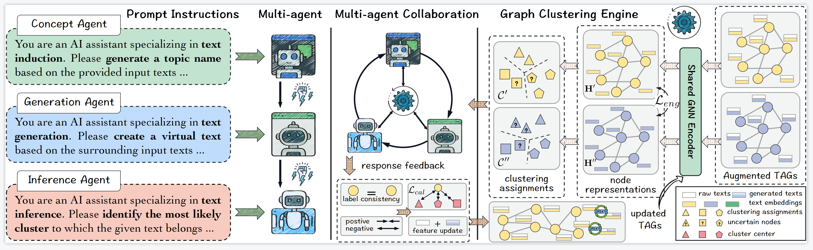

# MARK
PyTorch implementation for "MARK: Multi-agent Collaboration with Ranking Guidance for Text-attributed Graph Clustering"

## Overview

In this paper, we introduce a new perspective of leveraging large language models (LLMs) to enhance text-attributed graph clustering and develop a novel approach named Multi-agent Collaboration with Ranking Guidance (MARK). 

## Framework



## Installation

Start by following this source codes:
```bash
git clone https://github.com/fuyw-aisw/MARK.git
cd MARK
pip -r requirements.txt
## or install the following dependencies
## step1: install PyTorch’s CUDA support on Linux
pip install torch==2.0.0 torchvision==0.15.1 torchaudio==2.0.1 --index-url https://download.pytorch.org/whl/cu118
## step2: install pyg package
pip install torch_scatter torch_sparse torch_cluster torch_spline_conv torch_geometric -f https://data.pyg.org/whl/torch-2.0.0%2Bcu118.html ### GPU
```
## Usage

Download preprocessed data from [here] (https://drive.google.com/drive/folders/1Yz2AsR8gkY1W-pOpniI52bDG1ABvdEAF?usp=sharing). \
And then put them into the folder `MARK/preprocessed_data`. \

```
python main_magi.py

```
